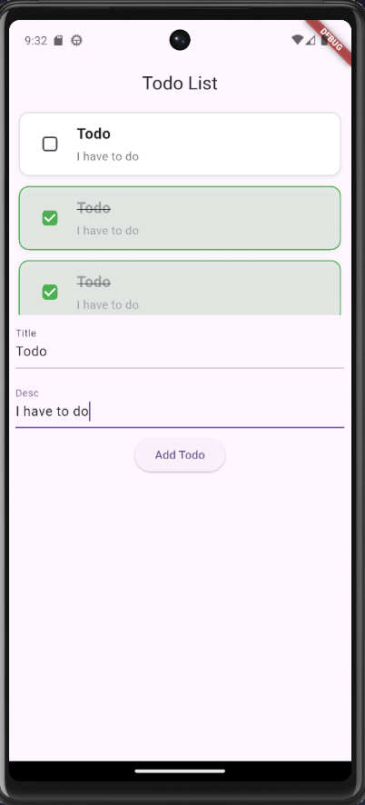

# 📝 Flutter Todo List App

A simple Todo List mobile application built with Flutter while learning Flutter development and mobile app fundamentals.

This project is my **first Flutter mobile application**, created to understand core concepts of Flutter like UI building, state management, widgets, and user interaction.

---

## 📱 App Preview




---

## 🚀 Features

* ➕ Add new todos with title and description
* 📋 Display list of todos dynamically
* ✔️ Mark todos as completed/uncompleted
* 🎨 Simple and clean UI
* 🧠 Basic state management using `setState`
* 🧩 Component-based structure (Screens, Widgets, Models)

---

## 🛠️ Built With

* Flutter SDK
* Dart
* Material Design Widgets

---

## 📂 Project Structure

```
lib/
│
├── main.dart
├── models/
│   └── todos_model.dart
│
├── screens/
│   └── home_screen.dart
│
└── widgets/
    └── todo.dart
```

---

## 📚 What We Learned

This project helps understanding:

* Flutter project structure
* Stateful vs Stateless widgets
* Passing data between widgets
* Using `TextEditingController`
* Managing state with `setState`
* Building reusable UI components
* Basic mobile UI design principles

---


## 🔧 How to Run

1. Clone the repository

```
git clone https://github.com/your-username/flutter-todo-app.git
```

2. Navigate to project folder

```
cd flutter-todo-app
```

3. Install dependencies

```
flutter pub get
```

4. Run the app

```
flutter run
```

---

## 🎯 Future Improvements

* Add delete/edit todo feature
* Persist data using local storage or Firebase
* Add task priority system
* Improve UI with better animations
* Add dark mode support

---
